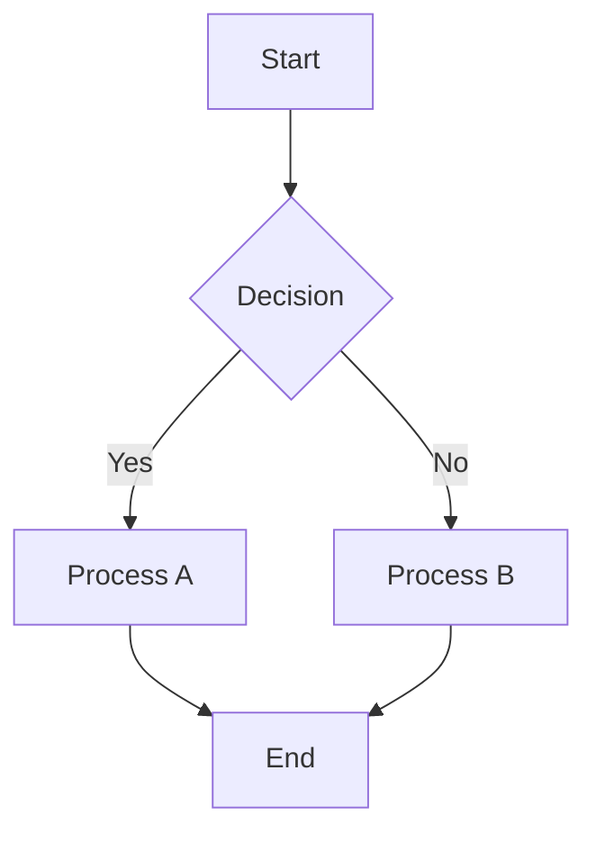

```mermaid
graph TD
    A[Start] --> B{Decision};
    B -- Yes --> C[Process A];
    C --> D[End];
    B -- No --> E[Process B];
    E --> D;
```
Example Mermaid diagram template. Replace with specific diagramming needs.